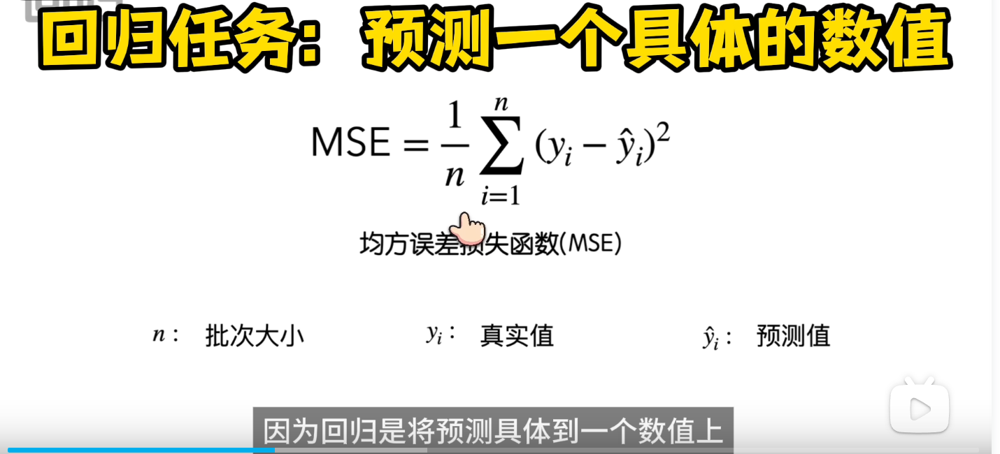
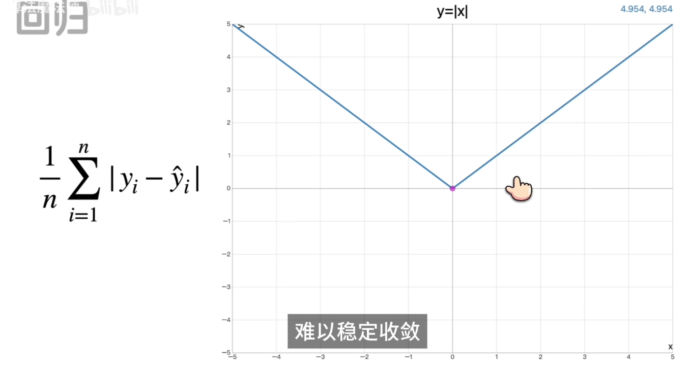

<!-- TOC -->
    * [损失函数](#损失函数)
      * [回归](#回归)
        * [MSE 均方误差损失函数](#mse-均方误差损失函数)
      * [分类](#分类)
        * [交叉熵](#交叉熵)
    * [梯度下降法](#梯度下降法)
    * [优化器](#优化器)
<!-- TOC -->
### 损失函数
衡量真实结果与预测之间差距的函数;loss是损失值，与预测结果负相关，值越小预测结果越准确
#### 回归
输出结果是一个收敛值
##### MSE 均方误差损失函数
 - 平方的目的
   1. 放大误差
   2. 抵消负值

#### 分类
输出结果是一个概率
##### 交叉熵
一件事件发生的概率越低，事件发生时包含的信息量越大。

### 梯度下降法
依赖损失函数的导数来计算优化的方向和步长，误差越小优化步长越小。（使用MSE时避免出现反向结果，使用平方抵消负值而不是绝对值）

### 优化器
根据损失函数的值调教模型
